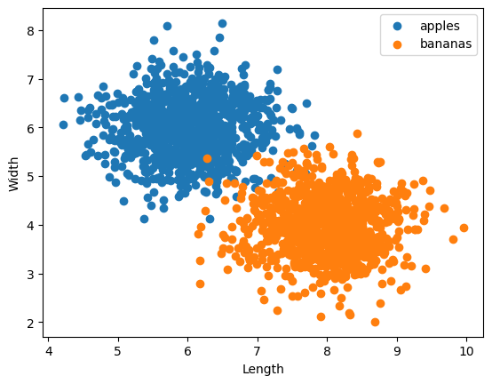
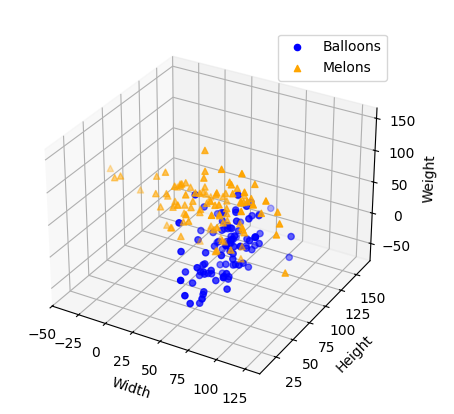
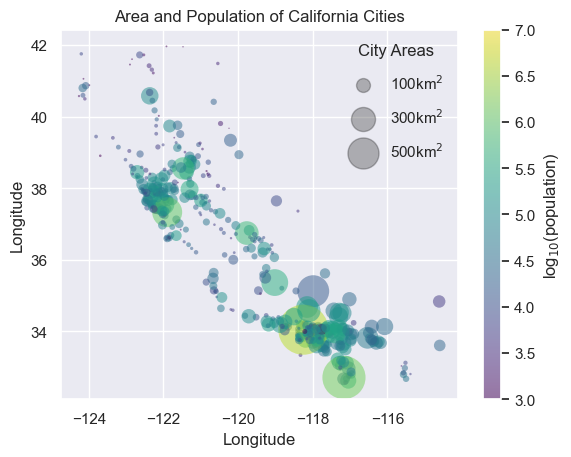

# Data Science 

This project encompasses a variety of tasks that demonstrate data science techniques, visualization approaches, and problem-solving skills. It includes practical implementations like fruit classification, geographic population analysis, and creative feature representation. 

---

### 1. Background on Data Science
- Contemporary data scientists come from diverse academic and professional backgrounds, such as engineering, statistics, and physics.
- A degree in fields like statistics or engineering can be helpful but is not a strict requirement for success in the data science domain.

---

## Project Highlights

### 1. Fruit Classification Problem (Apples 🍎 vs. Bananas 🍌 War)
- This section implements a clustering algorithm to classify apples and bananas using their respective features (e.g., length, width, weight).
- The code progresses to the **Visualization of the Training Process of the Clustering Algorithm**, where insights from the classification are displayed in an intuitive manner.

  **Output:**
     

---

### 2. Balloons 🎈 and Melons 🍈 Problem
- Inspired by the Apples and Bananas task, this problem involves generating a dataset with random features (length, width, and weight) for **balloons** and **melons**.
- Implements 3D plotting to visually compare the distributions of balloons and melons. This aids in understanding clustering and feature differentiation in higher dimensions.

  **Output:**
       
---

### 3. California Cities Problem
- This task analyzes the **area and population** of cities in California.
- Incorporates geographic data (latitude and longitude) and population metrics to create a scatterplot visualizing city size and population density.
- The plot uses advanced features like color scales (population log) and size scaling (area).

   **Output:**
       

---

## How to Run the Code
1. Clone the repository:
   ```sh
   https://github.com/nakhani/Data-Science/tree/ff8b9e02460849eaeaec511cb308c938aeb6f5c3/Data%20Science
   ```

2. Navigate to the directory:
   ```sh
   Data Science
   ```

3. Install the required packages:
   ```sh
   pip install -r requirements.txt
   ```

4. Run the assignments:
   ```sh
    python balloon.py  # For running Balloons and Melons Plot
   ```
   
   ```sh
    jupyter notebook apple.ipynb # For running Apple and Banana Plot
    jupyter notebook california.ipynb # For running California Cities Plot
   ```

## Technologies Used
- Python 3
- NumPy
- Matplotlib
- Seaborn
- Pandas