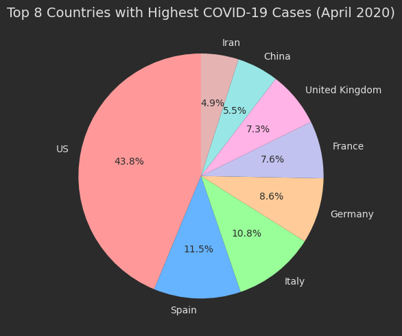
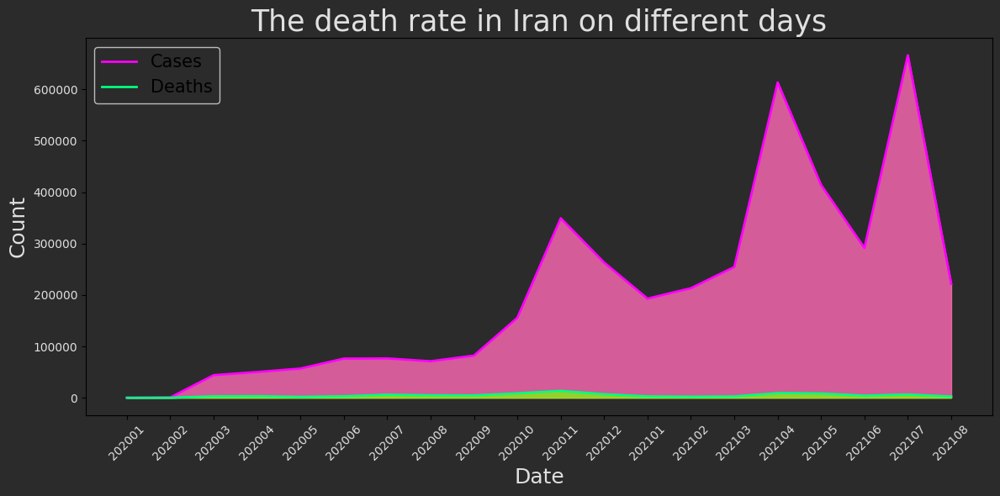
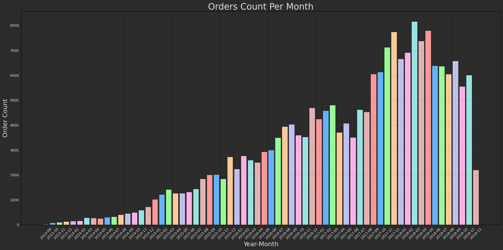
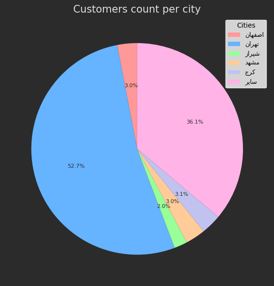

# Data Science 
This repository contains various data science projects, including analyses of **COVID-19** data and insights into **online retail** data and also **DigiKala** dataset. Each project is structured with tasks, analyses, and visual outputs.

---

## Projects


### 1. **Online Retail**
- **Objective**: Analyze and identify key events and trends related to online retail during April.
- **Dataset Address**: [Online Retail Dataset on Kaggle](https://www.kaggle.com/datasets/vijayuv/onlineretail)


#### A. Monthly Revenue
   - **Task**: Calculate the total revenue for each month.
   - **Result Visualization**:
     
     
     

#### B. Monthly Revenue Growth Rate
   - **Task**: Analyze the month-over-month revenue growth rate.
   - **Result Visualization**:
     
     
     

#### C. Monthly Active Customers
   - **Task**: Identify the number of active customers for each month.
   - **Result Visualization**:
     
     
     

#### D. Monthly Order Count
   - **Task**: Calculate the number of orders for each month.
   - **Result Visualization**:
     
     
     

#### E. Average Revenue per Order
   - **Task**: Compute the average revenue per order.
   - **Result Visualization**:
     
     
     

#### F. New Customer Ratio
   - **Task**: Analyze the ratio of new customers each month.
   - **Result Visualization**:
     
     
     

#### G. New Customers vs Existing Customers
   - **Task**: Compare the number of new customers to existing customers each month.
   - **Result Visualization**:
     
     
     

#### H. Monthly Retention Rate
   - **Task**: Calculate the retention rate of customers on a monthly basis.
   - **Result Visualization**:
     
     
     

---

### 2. **COVID-19 🦠**
Location: [COVID-19 Project on GitHub](https://github.com/SajjadAemmi/PyLearn/tree/main/5.DataScience/Covid-19)

#### A. Names of the 8 Countries with the Highest COVID-19 Cases in April 2020
- **Task**: Identify and display the top 8 countries with the highest number of COVID-19 cases during the fourth month of 2020.
- **Result Visualization**:

  

#### B. Death Rate in Iran on Different Days
- **Task**: Plot the death rate for Iran over different days.

  

---

### 3. **DigiKala 📦 Analysis**
Location: [DigiKala Project on GitHub](https://github.com/SajjadAemmi/PyLearn/tree/main/5.DataScience/Digikala/digikala_dataset)

#### A. Orders Count Per Month
- **Task**: Analyze the number of orders for each month and plot the results.
- **Result Visualization**:

  

#### B. Customers Count Per City
- **Task**: Create a pie plot to display the count of customers in each city.
- **Result Visualization**:

  

---

## How to Run the Code
1. Clone the repository:
   ```sh
   https://github.com/nakhani/Data-Science/tree/cbe1628d2d9166f5e18caaafd4db6969aac1dc87/Data%20Science_2
   ```

2. Navigate to the directory:
   ```sh
   Data Science_2
   ```

3. Install the required packages:
   ```sh
   pip install -r requirements.txt
   ```

4. Run the assignments:

   ```sh
    jupyter notebook covid19.ipynb # For running COVID-19-time-series Dataset analysis code 
    jupyter notebook digikala.ipynb # For running Digikala-orders Dataset analysis code 
    jupyter notebook onlineretail.ipynb # For running OnlineRetail Dataset analysis code 

   ```

## Technologies Used
- Python 3
- NumPy
- Matplotlib
- Pandas