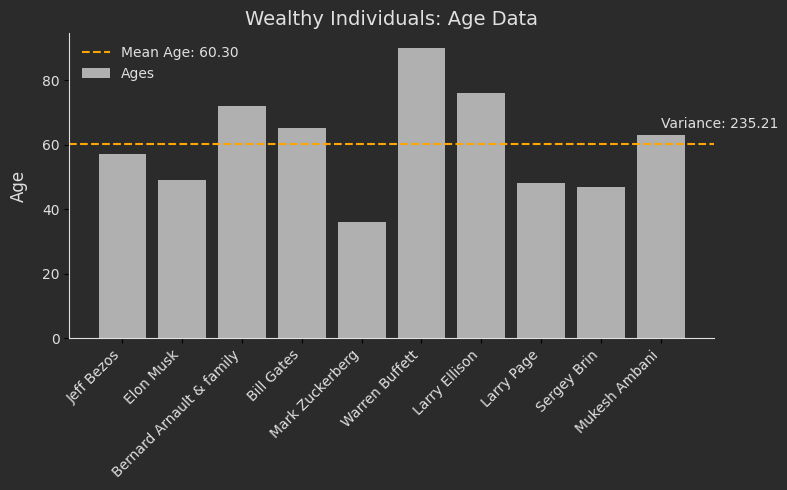
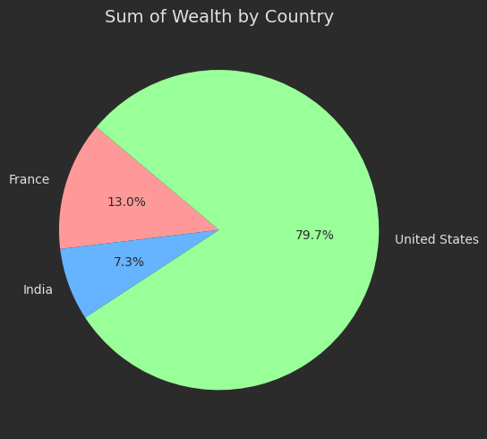
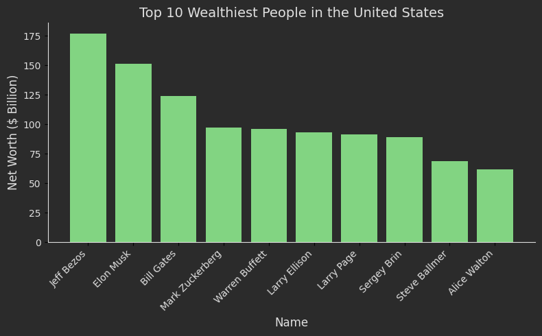
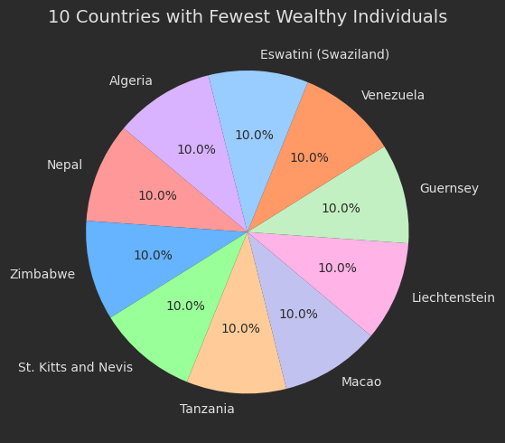

# Data Science 

we explore exciting datasets and perform advanced data analyses! This repository includes two major projects: an analysis of **billionaires 🤑** and an in-depth exploration of **Lionel Messi's ⚽️ scoring** history. Each project provides insights, visualizations, and thought-provoking questions.
---

## 1. Billionaires Analysis 🤑
In this section, we analyze data from the **Forbes Billionaires of 2021** dataset to uncover insights about the wealthiest individuals around the world. Below are the main tasks and their outputs:

- **Calculate the Mean and Variance of the Ages** of the world's billionaires.

   

- **Calculate the Total Wealth Per Country**.

     

- **Visualize the Top 10 Richest Americans** along with their wealth on a chart.

     

- **Visualize the 10 Countries With the Fewest Billionaires** and their counts on a chart.

     


---

## 2. Lionel Messi's Scoring History 🏃🏻‍♂️
This project focuses on analyzing **Lionel Messi's goals** and gaining insights into his performance over time. Below are the analyses:

- **Preprocess the Date Column to Extract Years**, then visualize the number of goals Messi scored each year on a chart.

     

- **Analyze Messi's Penalty Goals**, he use his Left Foot more.

     

- **Calculate the Percentage of Extra-Time Goals That Resulted in Victories** and visualize it on a chart.

     


- **Calculate the Percentage of Messi's Goals That Were Equalizers**.

     


---

## Repository Highlights ✨
- **Visualization**: Clean, professional charts are used to provide insights for each task.
- **Data Manipulation**: Includes preprocessing, aggregation, and feature engineering techniques.
- **Advanced Analytics**: Explores statistical calculations and meaningful percentages.
- **Clear Results**: Each task includes outputs and interpretations for clarity.

---

## How to Run the Code
1. Clone the repository:
   ```sh
   https://github.com/nakhani/Data-Science/tree/ff8b9e02460849eaeaec511cb308c938aeb6f5c3/Data%20Science
   ```

2. Navigate to the directory:
   ```sh
   Data Science_3
   ```

3. Install the required packages:
   ```sh
   pip install -r requirements.txt
   ```

4. Run the assignments:

   ```sh
    jupyter notebook Billionaires.ipynb # For running Billionairs Dataset analysis code 
    jupyter notebook lionel_messi.ipynb # For running Lionel Messi Dataset analysis code 
   ```

## Technologies Used
- Python 3
- NumPy
- Matplotlib
- Pandas